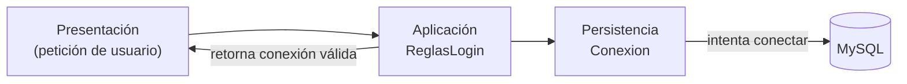

# ReglasLogin

La clase `ReglasLogin` pertenece a la **Capa de Aplicación** y se encarga de
gestionar el proceso de inicio de sesión seguro dentro del sistema.

Su responsabilidad principal es **coordinar la validación de credenciales**
utilizando la clase `Conexion` de la capa de Persistencia, sin exponer detalles
de acceso ni mezclar lógica de interfaz o acceso a la base de datos.

---

## Objetivos de esta capa en el contexto del login

- Controlar el flujo del proceso de autenticación.
- Realizar múltiples intentos de inicio de sesión (máximo 3).
- Evitar que la presentación se conecte directamente a la base de datos.
- Garantizar un manejo seguro de errores de conexión.
- Entregar una conexión válida solo si las credenciales son correctas.

---

## Flujo de funcionamiento

1. La capa de **Presentación** solicita las credenciales del usuario (MySQL).
2. `ReglasLogin` recibe esas credenciales a través de un *callback*.
3. La clase intenta abrir una conexión llamando internamente a `Conexion`.
4. Si la conexión es exitosa, retorna la instancia de conexión.
5. Si falla, descuenta un intento y vuelve a solicitar credenciales.
6. Si se alcanzan los 3 intentos, el sistema finaliza la ejecución.

---

## Diseño en la arquitectura por capas

