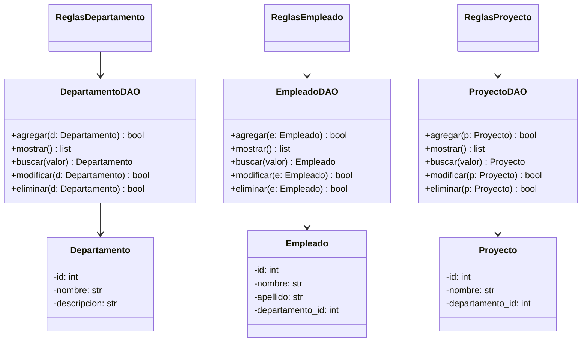

# Sistema de Gestión de Empleados EcoTech Solutions

Este proyecto implementa un sistema de gestión utilizando Python y MySQL bajo una arquitectura por capas.

El diseño busca mantener una separación clara de responsabilidades, aumentar la mantenibilidad del sistema y facilitar futuras extensiones.

---

## Instrucciones

## 1. Clonar el repositorio

```bash
git clone https://github.com/mc-herrera-90/gestion-empleados-por-capas.git
````

---

## 2. Configuración del entorno virtual

### Crear entorno virtual

```bash
# Windows
python -m venv venv

# macOS / Linux
python3 -m venv venv
```

### Activar el entorno virtual

```bash
# Windows
.\venv\Scripts\activate

# macOS / Linux
source venv/bin/activate
```

### Instalar dependencias

```bash
pip install -r requirements.txt
```

---

## 3. Generar documentación

La documentación se genera mediante **pdoc**:

```bash
pdoc . -o documentacion
```

Esto creará documentación HTML dentro de la carpeta `documentacion/`.

---

## 4. Arquitectura del sistema

El proyecto sigue una arquitectura por capas que permite desacoplar responsabilidades y organizar el código de forma clara:

```
Presentación → Aplicación → Dominio → Persistencia
```

Cada capa cumple funciones específicas:

| Capa                                  | Rol                                         |
| ------------------------------------- | ------------------------------------------- |
| **Presentación**                      | Muestra menús y recibe entradas del usuario |
| **Aplicación** (*ReglasDepartamento*) | Decide qué hacer con los datos              |
| **Dominio**                           | Define los objetos y estructuras de negocio |
| **Persistencia** (*DepartamentoDAO*)  | Guarda y recupera datos desde MySQL         |


### Capa de Presentación

Encargada de la interacción con el usuario. Contiene los menús, preguntas y salida por pantalla.
No implementa lógica de negocio ni accede a la base de datos.

### Capa de Aplicación

Coordina las acciones del sistema.
Recibe solicitudes de la presentación, crea objetos del dominio, ejecuta validaciones y delega las operaciones a la persistencia.

Su propósito es controlar el flujo general sin involucrarse en detalles técnicos.

> [!NOTE]  
> Es una capa **intermedia** que mantiene a tu proyecto ordenado, limpio y desacoplado.

### Capa de Dominio

Contiene las entidades centrales del sistema (por ejemplo, `Departamento`, `Empleado`, `Proyecto`).
Modela la estructura y reglas internas del negocio.

### Capa de Persistencia

Administra el acceso a MySQL mediante DAOs con consultas parametrizadas.
No conoce nada sobre la interfaz de usuario ni la lógica de control.

---

## 5. Diagrama

El siguiente diagrama muestra la estructura conceptual del sistema, basada en el modelo solicitado:



---

## 6. Estructura del proyecto

```
proyecto/
│── aplicacion/
│── dominio/
│── persistencia/
│── presentacion/
│── documentacion/
│── requirements.txt
│── main.py
│── readme.md
```

Cada carpeta corresponde a una capa independiente del sistema.

---

## 7. Ejecución del programa

```bash
python main.py
```

---

## 8. Consideraciones finales

La arquitectura adoptada proporciona:

* Código más organizado y fácil de mantener
* Separación estricta entre lógica, representación y acceso a datos
* Menor acoplamiento entre componentes
* Mayor facilidad para extender o modificar partes del sistema
* Mejor soporte para pruebas unitarias

Esta estructura permite que el sistema pueda crecer sin comprometer la claridad ni la estabilidad del proyecto.
